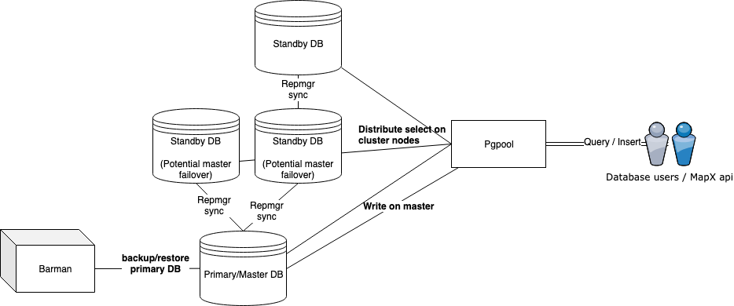

# Postgis cluster for MapX
- [Goals](#goals)
  * [Alternatives](#alternatives)
  * [Choosed solution](#choosed-solution)
- [Features](#features)
  * [What's in the box](#whats-in-the-box)
- [Architecture](#architecture)
- [How to use the cluster](#how-to-use-the-cluster)
  * [Build all images](#build-all-images)
  * [Start cluster with docker-compose](#start-cluster-with-docker-compose)
  * [Configuring the cluster](#configuring-the-cluster)
- [Backups and recovery](#backups-and-recovery)
- [Useful commands](#useful-commands)
- [Scenarios](#scenarios)
- [FAQ](#faq)
- [Documentation and references](#documentation-and-references)

-------
## Goals
- Clustered database to balance requests on
- Fail-over
- Quick Backup

### Alternatives


| Program                    | License          | Maturity             | Replication Method                           | Sync                        | Connection Pooling | Load Balancing | Query Partitioning |
|----------------------------|------------------|----------------------|----------------------------------------------|-----------------------------|--------------------|----------------|--------------------|
| PgCluster                  | BSD              | Not production ready | Master-Master                                | Synchronous                 | No                 | Yes            | No                 |
| pgpool-I                   | BSD              | Stable               | Statement-Based Middleware                   | Synchronous                 | Yes                | Yes            | No                 |
| Pgpool-II                  | BSD              | Recent release       | Statement-Based Middleware                   | Synchronous                 | Yes                | Yes            | Yes                |
| slony                      | BSD              | Stable               | Primary-Replica                              | Asynchronous                | No                 | No             | No                 |
| Bucardo                    | BSD              | Stable               | Master-Master, Primary-Replica               | Asynchronous                | No                 | No             | No                 |
| Londiste                   | BSD              | Stable               | Primary-Replica                              | Asynchronous                | No                 | No             | No                 |
| Mammoth                    | BSD              | No longer maintained | Primary-Replica                              | Asynchronous                | No                 | No             | No                 |
| rubyrep                    | MIT              | No longer maintained | Master-Master, Primary-Replica               | Asynchronous                | No                 | No             | No                 |
| Bi-Directional Replication | PostgreSQL (BSD) | Recent release       | Master-Master                                | Asynchronous                | No                 | No             | No                 |
| pg_shard                   | LGPL             | Recent release       | Statement-based Middleware (as an extension) | Synchronous                 | No                 | Yes            | Yes                |
| pglogical                  | PostgreSQL       | Recent release       | Primary-Replica                              | Asynchronous                | No                 | No             | No                 |
| Postgres-XL                | PostgreSQL       | Recent release       | MPP Postgres, scalable writes & reads        | Synchronous                 | Yes                | Yes            | Yes                |
| Citus                      | AGPL             | Recent release       | MPP Postgres, scalable writes & reads        | Asynchronous or Synchronous | Yes                | Yes            | Yes                |


- Postgres-XL (A fork of Postgres with latency for updates and potential issues for postgis extension)
- Citus (Minus Free but some essential function are missing in free version)
- Pgool-II (Choosed solution)


### Choosed Solution

| Software      | Version | Docker Image       | Role                                                       |
| ------------- |:-------:|:------------------:|:----------------------------------------------------------:|
| Postgres      | v10     | postgis.dockerfile | Object-relational database                                 |
| Reprmgr       | v4.0    | postgis.dockerfile | Replication in a cluster of PostgreSQL servers             |
| Pgpool-II     | v3.7    | pgpool.dockerfile  | Load balancer - Failover - Connection pooling              |
| Barman        | v2.5    | barman.dockerfile  | Backup and Recovery Manager                                |


## Features
Postgis cluster with **High Availability** and **Self Healing** features for docker environment

* High Availability
* Self Healing and Automated Reconstruction
* [Split Brain](https://en.wikipedia.org/wiki/Split-brain_(computing)) Tolerance
* Eventually/Partially Strict/Strict Consistency modes
* Reads Load Balancing and Connection Pool
* Incremental backup (with optional zero data loss, [RPO=0](https://en.wikipedia.org/wiki/Recovery_point_objective))
* Semi-automated Point In Time Recovery Procedure
* Monitoring exporters for all the components(nodes, balancers, backup)


### What's in the box
* Dockerfiles for `postgresql` cluster and backup system
    * [postgresql](./src/postgis.dockerfile)
    * [pgpool](./src/pgpool.dockerfile)
    * [barman](./src/barman.dockerfile)
* Examples of usage(suitable for production environment as architecture has fault protection with auto failover)
    * example of [docker-compose](./docker-compose/docker-compose.yml) file to start this cluster.


## Architecture



- All Postgres nodes have the full database but not all last inserts. Because insert are only done on the primary node.
- Last changes are streamed down to standby nodes after some latency (some seconds or less).
- Reprmgr detect if a node is no more reachable and will fail-over streaming from another active node. It allows also to check cluster status.
- Pgpool detect the state of the nodes also fail over and remove unreachable nodes (re-adding a failing node is manual or restart pgpool node)
- Backup is independent of other nodes, he only have a connection to the primary node (configured at startup time) 

## How to use the cluster

### Build all images


`docker build -t kb/postgis -f src/postgis.dockerfile src`

`docker build -t kb/pgpool -f src/pgpool.dockerfile src`

`docker build -t kb/barman -f src/barman.dockerfile src`

### Start cluster with docker-compose

To start cluster run it as normal `docker-compose` application.

`docker-compose -f docker-compose/docker-compose.yml up -d pgmaster pgslave1 pgslave2 pgslave3 pgpool backup`


### Configuring the cluster

You can configure any node of the cluster(`postgres.conf`) or pgpool(`pgpool.conf`) with ENV variable `CONFIGS` (format: `variable1:value1[,variable2:value2[,...]]`, you can redefine delimiter and assignment symbols by using variables `CONFIGS_DELIMITER_SYMBOL`, `CONFIGS_ASSIGNMENT_SYMBOL`). Also see the dockerfiles and [docker-compose/docker-compose.yml](./docker-compose/docker-compose.yml) files to understand all available and used configurations!

#### Postgres

The most important part to configure in Pgpool (apart of general `CONFIGS`) is backends and users which could access these backends. You can configure backends with ENV variable. You can find good example of setting up pgpool in [docker-compose/docker-compose.yml](./docker-compose/docker-compose.yml) file:

##### Adaptive mode

For the rest - you better **follow** the advise and look into the [src/postgis.dockerfile](./src/postgis.dockerfile)
'Adaptive mode' means that node will be able to decide if instead of acting as a master on it's start or switch to standby role.
That possible if you pass `PARTNER_NODES` (comma separated list of nodes in the cluster on the same level).
So every time container starts it will check if it was master before and if there is no new master around (from the list `PARTNER_NODES`),
otherwise it will start as a new standby node with `upstream = new master` in the cluster.

Keep in mind: this feature does not work for cascade replication and you should not pass `PARTNER_NODES` to nodes on second level of the cluster.
Instead of it just make sure that all nodes on the first level are running, so after restart any node from second level will be able to follow initial upstream from the first level.
That also can mean - replication from second level potentially can connect to root master... Well not a big deal if you've decided to go with adaptive mode.
But nevertheless you are able to play with `NODE_PRIORITY` environment variable and make sure entry point for second level of replication will never be elected as a new root master 

#### Pgpool

```
DB_USERS: monkey_user:monkey_pass # in format user:password[,user:password[...]]
BACKENDS: "0:pgmaster:5432:1:/var/lib/postgresql/data:ALLOW_TO_FAILOVER,1:pgslave1::::,3:pgslave3::::,2:pgslave2::::" #,4:pgslaveDOES_NOT_EXIST::::
            # in format num:host:port:weight:data_directory:flag[,...]
            # defaults:
            #   port: 5432
            #   weight: 1
            #   data_directory: /var/lib/postgresql/data
            #   flag: ALLOW_TO_FAILOVER
REQUIRE_MIN_BACKENDS: 3 # minimal number of backends to start pgpool (some might be unreachable)
```

#### Barman

The most important part for barman is to setup access variables. Example can be found in [docker-compose/docker-compose.yml](./docker-compose/docker-compose.yml) file:

```
REPLICATION_USER: replication_user # default is replication_user
REPLICATION_PASSWORD: replication_pass # default is replication_pass
REPLICATION_HOST: pgmaster
POSTGRES_PASSWORD: monkey_pass
POSTGRES_USER: monkey_user
POSTGRES_DB: monkey_db
BACKUP_SCHEDULE "0 0 * * *"
BACKUP_RETENTION_DAYS "30"
BACKUP_DIR /var/backups
```


#### SSH Access

If you have need to organize your cluster with some tricky logic or less problematic cross checks. You can enable SSH server on each node. Just set ENV variable `SSH_ENABLE=1` (disabled by default) in all containers (including pgpool and barman). That will allow you to connect from any to any node by simple command under `postgres` user: `gosu postgres ssh {NODE NETWORK NAME}`

You also will have to set identical ssh keys to all containers. For that you need to mount files with your keys in paths `/var/lib/postgresql/.ssh/keys/id_rsa`, `/var/lib/postgresql/.ssh/keys/id_rsa.pub`.


## Backups and recovery

[Barman](http://docs.pgbarman.org/) is used to provide real-time backups and Point In Time Recovery (PITR)..
This image requires connection information(host, port) and 2 sets of credentials, as you can see from [the dockerfile](./src/barman.dockerfile):

* Replication credentials
* Postgres admin credentials

Barman acts as warm standby and stream WAL from source. Additionaly it periodicaly takes remote physical backups using `pg_basebackup`.
This allows to make PITR in reasonable time within window of specified size, because you only have to replay WAL from lastest base backup.
Barman automatically deletes old backups and WAL according to retetion policy.
Backup source is static — pgmaster node.
In case of master failover, backuping will continue from standby server!
Whole backup procedure is performed remotely, but for recovery SSH access is required.

*Before using in production read following documentation:*
 * http://docs.pgbarman.org/release/2.5/index.html
 * https://www.postgresql.org/docs/current/static/continuous-archiving.html

*For Disaster Recovery process see [RECOVERY.md](./doc/RECOVERY.md)*

Barman exposes several metrics on `:8080/metrics` for more information see [Barman docs](./barman/README.md)

## Useful commands

Any command might be wrapped with `docker-compose -f docker-compose/docker-compose exec {NODE} bash -c '{COMMAND}'`

`docker-compose -f docker-compose/docker-compose ps`

Get map from Repmgr of current cluster on any `postgres` node:

`docker-compose -f docker-compose/docker-compose.yml exec pgXXX bash -c 'gosu postgres repmgr cluster show'`

Get `pgpool` status:

`docker-compose -f docker-compose/docker-compose.yml exec pgpool bash -c 'PGPASSWORD=$CHECK_PASSWORD psql -U $CHECK_USER -h localhost template1 -c "show pool_nodes"'`

Postgres containers: detect if node acts as a 'false'-master and there is another master - with more standbys:

`docker-compose -f docker-compose/docker-compose.yml exec pgXXX bash -c '/usr/local/bin/cluster/healthcheck/is_major_master.sh'`

Check if there are enough backend behind `pgpool`

`docker-compose -f docker-compose/docker-compose.yml exec pgpool bash -c '/usr/local/bin/pgpool/has_enough_backends.sh'`
 
Check if one of the backend can be used as a master with write access behind `pgpool`. Return code 0 is for yes.
`docker-compose -f docker-compose/docker-compose.yml exec pgpool bash -c '/usr/local/bin/pgpool/has_write_node.sh' && echo $?`

Backup system:

`docker-compose -f docker-compose/docker-compose.yml exec barman -c 'barman --help'`

To make sure you cluster works as expected without 'split-brain' or other issues, you have to setup health-checks and stop container if any health-check returns non-zero result.

## Scenarios

Check [the document](./doc/FLOWS.md) to understand different cases of failover, split-brain resistance and recovery

## Documentation and references

* Solutions: https://wiki.postgresql.org/wiki/Replication,_Clustering,_and_Connection_Pooling
* Postdock: https://github.com/paunin/PostDock
* Streaming replication in postgres: https://wiki.postgresql.org/wiki/Streaming_Replication
* Repmgr: https://github.com/2ndQuadrant/repmgr
* Pgpool2: http://www.pgpool.net/docs/latest/pgpool-en.html
* Barman: http://www.pgbarman.org/